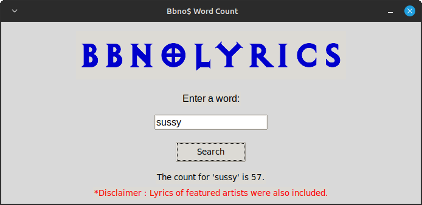

# <b> Bbno$ Song Lyrics Analysis : Most Used Words Revealed with Python.</b>

### In this Jupyter notebook project, I used the BeautifulSoup library to scrape the lyrics of all the songs produced by the artist "bbno$", then calculated the most frequent words.
### First, I scraped the entire song titles of bbno$ using BeautifulSoup from the website genius.com.
### Next, I used those titles to scrape the lyrics for each song using BeautifulSoup from the same website.
### Then, I squished all the words into a single list by combining the lyrics of all the songs.
### Finally, I used the Counter class from the collections module to count how many times each word appeared in the list.

#### 

# <b> Results:</b>
### Below are the top 20 most frequently used words in Bbno$ songs, with certain recurring words such as 'I', 'you', 'that', etc... excluded from the list:
<table border="1" class="dataframe">
  <thead>
    <tr style="text-align: right;">
      <th></th>
      <th>Word</th>
      <th>Count</th>
    </tr>
  </thead>
  <tbody>
    <tr>
      <th>0</th>
      <td>yeah</td>
      <td>1237</td>
    </tr>
    <tr>
      <th>1</th>
      <td>bitch</td>
      <td>621</td>
    </tr>
    <tr>
      <th>2</th>
      <td>baby</td>
      <td>559</td>
    </tr>
    <tr>
      <th>3</th>
      <td>money</td>
      <td>525</td>
    </tr>
    <tr>
      <th>4</th>
      <td>shit</td>
      <td>507</td>
    </tr>
    <tr>
      <th>5</th>
      <td>know</td>
      <td>385</td>
    </tr>
    <tr>
      <th>6</th>
      <td>need</td>
      <td>354</td>
    </tr>
    <tr>
      <th>7</th>
      <td>fuck</td>
      <td>337</td>
    </tr>
    <tr>
      <th>8</th>
      <td>bbno$</td>
      <td>310</td>
    </tr>
    <tr>
      <th>9</th>
      <td>gravy</td>
      <td>226</td>
    </tr>
    <tr>
      <th>10</th>
      <td>think</td>
      <td>214</td>
    </tr>
    <tr>
      <th>11</th>
      <td>back</td>
      <td>202</td>
    </tr>
    <tr>
      <th>12</th>
      <td>make</td>
      <td>198</td>
    </tr>
    <tr>
      <th>13</th>
      <td>tryna</td>
      <td>197</td>
    </tr>
    <tr>
      <th>14</th>
      <td>wrist</td>
      <td>189</td>
    </tr>
    <tr>
      <th>15</th>
      <td>come</td>
      <td>187</td>
    </tr>
    <tr>
      <th>16</th>
      <td>check</td>
      <td>186</td>
    </tr>
    <tr>
      <th>17</th>
      <td>skrrt</td>
      <td>184</td>
    </tr>
    <tr>
      <th>18</th>
      <td>girl</td>
      <td>177</td>
    </tr>
    <tr>
      <th>19</th>
      <td>wanna</td>
      <td>174</td>
    </tr>
  </tbody>
</table>
</div>

# Wanna find out what's the count of other words?
### If you want to know the count of other words, you can consult the  containing all the data or use the cool user friendly Tkinter app I made.
### The app allows you to simply type in the word you're looking for and get its count.


# Requirements
### You only need to have <a href="https://www.python.org/downloads/">Python</a> installed as well as the Tkinter and Pandas modules.  
### I already included a ```requirements.txt``` file located inside the ```bbnolyrics/``` folder so you can install them easily using this command:
```
$ pip install -r requirements.txt
```
### After installing all the requirements, locate the ```bbnolyrics/app.py``` file and open it with Python.

# <b>Summary:</b>
### In summary, I scanned a total of 245 songs (99,413 words) from bbno$ and analyzed the lyrics to identify the top 20 most frequently used words.
### It is important to note that while this analysis provides valuable information, the downside is that the lyrics of featured artists were also included in the analysis.
### Therefore, the top 20 words identified may not be solely representative of bbno$'s own lyrical style.