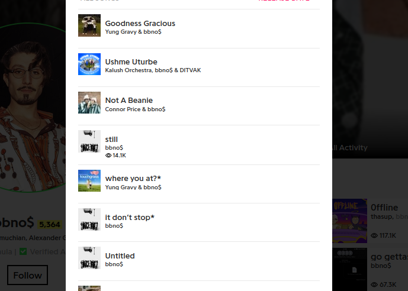

# <b> Bbno$ Song Lyrics Analysis : Most Used Words Revealed with Python.</b>

#### In this Jupyter notebook project, I used the BeautifulSoup library to scrape the lyrics of songs by the artist "bbno$".
#### First, I scraped the entire song titles of bbno$ using BeautifulSoup from the website genius.com.
#### Next, I used those titles to scrape the lyrics for each song using BeautifulSoup from the same website.
#### Then, I squished all the words into a single list by combining the lyrics of all the songs.
#### Finally, I used the Counter class from the collections module to count how many times each word appeared in the list.


```python
# import necessary modules

from bs4 import BeautifulSoup
import requests
import pandas as pd
```

## <b>Retrieve track titles and artist names.
#### In order to form a list of pairs in this format ['song title', 'artist'] I visited genius.com and saved an html page displaying the entire discography of bbno$.
#### The page looks like the following:
<br>File path : /html_page/discography.html
#### Now let's use webscraping to iterate through HTML elements and extract the titles and the artits involved in each track.


```python
# Open the file then parse it with bs4
with open("discoraphy_html/discography.html") as f:
    soup = BeautifulSoup(f, 'html.parser')
```


```python
# Retrieve the <div> element representing the white window
tracks_div = soup.find('div', {'class' : 'modal_window-content modal_window-content--narrow_width modal_window-content--white_background'})

# Extract <div> elements that belong to the title class
titles_div = tracks_div.find_all('div', {'class': 'mini_card-title'})
# Same procedure for the artits
artist_div = tracks_div.find_all('div', {'class': 'mini_card-subtitle'})

# Sanity check
len(titles_div) == len(artist_div)
```


    True


```python
# Merge their respective innerHTMLs into a list
tracks = [[t.text, a.text] for t, a in zip(titles_div, artist_div)]

# Remove remaining unicode characters
for i in range(len(tracks)):
    for j in range(2):
        tracks[i][j] = tracks[i][j].replace('\n', '').replace('\u200b', '')

pd.DataFrame(tracks, columns=['Title', 'Artist'])
```


<div>
<table border="1" class="dataframe">
  <thead>
    <tr style="text-align: right;">
      <th></th>
      <th>Title</th>
      <th>Artist</th>
    </tr>
  </thead>
  <tbody>
    <tr>
      <th>0</th>
      <td>Goodness Gracious</td>
      <td>Yung Gravy &amp; bbno$</td>
    </tr>
    <tr>
      <th>1</th>
      <td>Ushme Uturbe</td>
      <td>Kalush Orchestra, bbno$ &amp; DITVAK</td>
    </tr>
    <tr>
      <th>2</th>
      <td>Not A Beanie</td>
      <td>Connor Price &amp; bbno$</td>
    </tr>
    <tr>
      <th>3</th>
      <td>still</td>
      <td>bbno$</td>
    </tr>
    <tr>
      <th>4</th>
      <td>where you at?*</td>
      <td>Yung Gravy &amp; bbno$</td>
    </tr>
    <tr>
      <th>...</th>
      <td>...</td>
      <td>...</td>
    </tr>
    <tr>
      <th>266</th>
      <td>Puma</td>
      <td>$NOT</td>
    </tr>
    <tr>
      <th>267</th>
      <td>improvisation</td>
      <td>bbno$</td>
    </tr>
    <tr>
      <th>268</th>
      <td>tamagotchi*</td>
      <td>bbno$</td>
    </tr>
    <tr>
      <th>269</th>
      <td>property*</td>
      <td>bbno$</td>
    </tr>
    <tr>
      <th>270</th>
      <td>indiana jones*</td>
      <td>bbno$</td>
    </tr>
  </tbody>
</table>
<p>271 rows × 2 columns</p>
</div>


## <b>Now let's eliminate unrealeased tracks.</b>
#### Titles ending with an asterix('*') indicate that the song was never officially released.
#### We must also filter out remixes because they contain redundant lyrics.


```python
official_tracks = []

for track in tracks:
        if track[0][-1] == '*' or 'remix' in track[0].lower():
                pass
        else:
                official_tracks.append(track)
                
pd.DataFrame(official_tracks, columns=['Title', 'Artist'])
```


<div>
<table border="1" class="dataframe">
  <thead>
    <tr style="text-align: right;">
      <th></th>
      <th>Title</th>
      <th>Artist</th>
    </tr>
  </thead>
  <tbody>
    <tr>
      <th>0</th>
      <td>Goodness Gracious</td>
      <td>Yung Gravy &amp; bbno$</td>
    </tr>
    <tr>
      <th>1</th>
      <td>Ushme Uturbe</td>
      <td>Kalush Orchestra, bbno$ &amp; DITVAK</td>
    </tr>
    <tr>
      <th>2</th>
      <td>Not A Beanie</td>
      <td>Connor Price &amp; bbno$</td>
    </tr>
    <tr>
      <th>3</th>
      <td>still</td>
      <td>bbno$</td>
    </tr>
    <tr>
      <th>4</th>
      <td>Untitled</td>
      <td>bbno$</td>
    </tr>
    <tr>
      <th>...</th>
      <td>...</td>
      <td>...</td>
    </tr>
    <tr>
      <th>240</th>
      <td>Dumb lit</td>
      <td>Lucid Monday &amp; bbno$</td>
    </tr>
    <tr>
      <th>241</th>
      <td>Bad thot</td>
      <td>LUX (luxlafuego)</td>
    </tr>
    <tr>
      <th>242</th>
      <td>centerfold</td>
      <td>bbno$</td>
    </tr>
    <tr>
      <th>243</th>
      <td>Puma</td>
      <td>$NOT</td>
    </tr>
    <tr>
      <th>244</th>
      <td>improvisation</td>
      <td>bbno$</td>
    </tr>
  </tbody>
</table>
<p>245 rows × 2 columns</p>
</div>


```python
# There are some unreleased tracks that do not end with an asterix, instead they have a (Unreleased) legend attached to them
# I will have to manually delete them :(
Unreleased_titles = ['Untitled #2', 'Pussy Boy', 'Crunch It Up', 'simulation', 'BB$xOT', 'Bad thot']
official_tracks_2 = []

for t in official_tracks:
    if t[0] in Unreleased_titles:
        pass
    else:
        official_tracks_2.append(t)

```

# <b>Retrive lyrics for each song.</b>
### Again, we will be using webscraping to obtain song lyrics, only this time it would be exausting to manually download the html pages for each track.
### Instead, we are going to construct a URL in this format: https://genius.com/Bbno-yung-gravy-and-lentra-jack-money-bean-lyrics, and use it to obtain the HTML code.
### The genius.com URL is composed of:
<ol>
<h5>
<li>The base part "https://genius.com/"</li>
<li>The artist's username.</li>
<li>The track's title.</li>
<li>The "lyrics" parameter.</li>
</h5>
<p><i>Keep in mind all that the strings must be seperated by a ' - ' character .</i></p>
</ol>

### First let's prepare our strings for the URL.


```python
# Modify strings to fit the genius URL 
def fit_to_url(tracklist):
    tracklist_formatted = []
    for track in tracklist:
        track[0] = '-'.join(track[0].replace('!', '').replace('?','').replace('(', '').replace(')', '').replace('/', '-').split())
        track[1] = '-'.join(track[1].split())
        track[1] = track[1].replace(' ', '').replace(',', '').replace('&', 'and').replace('$', '')
        tracklist_formatted.append(track)
    return tracklist_formatted
```


```python
official_tracks = fit_to_url(official_tracks_2)
pd.DataFrame(official_tracks, columns=['Title', 'Artist'])
```


<div>
<table border="1" class="dataframe">
  <thead>
    <tr style="text-align: right;">
      <th></th>
      <th>Title</th>
      <th>Artist</th>
    </tr>
  </thead>
  <tbody>
    <tr>
      <th>0</th>
      <td>Goodness-Gracious</td>
      <td>Yung-Gravy-and-bbno</td>
    </tr>
    <tr>
      <th>1</th>
      <td>Ushme-Uturbe</td>
      <td>Kalush-Orchestra-bbno-and-DITVAK</td>
    </tr>
    <tr>
      <th>2</th>
      <td>Not-A-Beanie</td>
      <td>Connor-Price-and-bbno</td>
    </tr>
    <tr>
      <th>3</th>
      <td>still</td>
      <td>bbno</td>
    </tr>
    <tr>
      <th>4</th>
      <td>Untitled</td>
      <td>bbno</td>
    </tr>
    <tr>
      <th>...</th>
      <td>...</td>
      <td>...</td>
    </tr>
    <tr>
      <th>234</th>
      <td>Stupid</td>
      <td>Lucid-Monday-and-bbno</td>
    </tr>
    <tr>
      <th>235</th>
      <td>Dumb-lit</td>
      <td>Lucid-Monday-and-bbno</td>
    </tr>
    <tr>
      <th>236</th>
      <td>centerfold</td>
      <td>bbno</td>
    </tr>
    <tr>
      <th>237</th>
      <td>Puma</td>
      <td>NOT</td>
    </tr>
    <tr>
      <th>238</th>
      <td>improvisation</td>
      <td>bbno</td>
    </tr>
  </tbody>
</table>
<p>239 rows × 2 columns</p>
</div>


## Let's test this on a random song.


```python
import random

index = random.randint(0, len(official_tracks)-1)

test_url = "https://genius.com/" + official_tracks[index][1] + "-" + official_tracks[index][0] + "-lyrics"
test_url
```


    'https://genius.com/Crispy-Concords-whatchu-mean-lyrics'


## <span style="color:green">Seems to work :)</span>
### Now let's scrape the page for lyrics.


```python
headers = {
    'Access-Control-Allow-Origin': '*',
    'Access-Control-Allow-Methods': 'GET',
    'Access-Control-Allow-Headers': 'Content-Type',
    'Access-Control-Max-Age': '3600',
    'User-Agent': 'Mozilla/5.0 (X11; Ubuntu; Linux x86_64; rv:52.0) Gecko/20100101 Firefox/52.0'
    }

# Get HTML
page = requests.get(test_url, headers)
soup = BeautifulSoup(page.text, 'html.parser')

# Extract <div> elements that belong to the lyrics class
lyrics_div = soup.find_all('div', {'class' : 'Lyrics__Container-sc-1ynbvzw-5 Dzxov'})
lyrics_div
```


    [<div class="Lyrics__Container-sc-1ynbvzw-5 Dzxov" data-lyrics-container="true">[Intro: bbno$]<br/><a class="ReferentFragmentdesktop__ClickTarget-sc-110r0d9-0 cesxpW" href="/24603753/Crispy-concords-whatchu-mean/Ayy-man-the-the-fuck-you-mean-you-aint-heard-no-fuckin-lentra-the-god"><span class="ReferentFragmentdesktop__Highlight-sc-110r0d9-1 jAzSMw"><i>Ayy, man, the-, the fuck you mean you ain't heard no fuckin' Lentra the God?</i></span></a><span style="position:absolute;opacity:0;width:0;height:0;pointer-events:none;z-index:-1" tabindex="0"></span><span><span style="position:absolute;opacity:0;width:0;height:0;pointer-events:none;z-index:-1" tabindex="0"></span><span style="position:absolute;opacity:0;width:0;height:0;pointer-events:none;z-index:-1" tabindex="0"></span></span><br/><a class="ReferentFragmentdesktop__ClickTarget-sc-110r0d9-0 cesxpW" href="/24600698/Crispy-concords-whatchu-mean/Im-in-austin-for-the-first-time-ever-and-im-kinda-horny-and-shit"><span class="ReferentFragmentdesktop__Highlight-sc-110r0d9-1 jAzSMw">I'm in Austin for the first time ever, and I'm kinda horny and shit</span></a><span style="position:absolute;opacity:0;width:0;height:0;pointer-events:none;z-index:-1" tabindex="0"></span><span><span style="position:absolute;opacity:0;width:0;height:0;pointer-events:none;z-index:-1" tabindex="0"></span><span style="position:absolute;opacity:0;width:0;height:0;pointer-events:none;z-index:-1" tabindex="0"></span></span><br/><br/>[Chorus: bbno$]<br/>Whatchu mean by that? (Huh?) I'm curious<br/><a class="ReferentFragmentdesktop__ClickTarget-sc-110r0d9-0 cesxpW" href="/25650355/Crispy-concords-whatchu-mean/Nut-in-your-girl-real-fast-she-furious-skrrt"><span class="ReferentFragmentdesktop__Highlight-sc-110r0d9-1 jAzSMw">Nut in your girl real fast, she furious (Skrrt)</span></a><span style="position:absolute;opacity:0;width:0;height:0;pointer-events:none;z-index:-1" tabindex="0"></span><span><span style="position:absolute;opacity:0;width:0;height:0;pointer-events:none;z-index:-1" tabindex="0"></span><span style="position:absolute;opacity:0;width:0;height:0;pointer-events:none;z-index:-1" tabindex="0"></span></span><br/>Bitch, I'm mysterious, <a class="ReferentFragmentdesktop__ClickTarget-sc-110r0d9-0 cesxpW" href="/24623334/Crispy-concords-whatchu-mean/Pull-up-in-the-back-of-her-butt-johnny-sins"><span class="ReferentFragmentdesktop__Highlight-sc-110r0d9-1 jAzSMw">pull up in the back of her butt<br/>Johnny Sins,</span></a><span style="position:absolute;opacity:0;width:0;height:0;pointer-events:none;z-index:-1" tabindex="0"></span><span><span style="position:absolute;opacity:0;width:0;height:0;pointer-events:none;z-index:-1" tabindex="0"></span><span style="position:absolute;opacity:0;width:0;height:0;pointer-events:none;z-index:-1" tabindex="0"></span></span> well, hmm, I'm serious<br/>Big ass balls, big ass house, ayy<br/>Big ass checks, hot ass spouse, ayy<br/>Grind the cheese, I'm Mickey Mouse, ayy<br/>Suck on these, they in your mouth, ayy<br/><br/>[Verse 1: Crispy Concords]<br/><a class="ReferentFragmentdesktop__ClickTarget-sc-110r0d9-0 cesxpW" href="/26752292/Crispy-concords-whatchu-mean/I-feel-like-horton-who-who-the-fuck-are-you-who"><span class="ReferentFragmentdesktop__Highlight-sc-110r0d9-1 jAzSMw">I feel like Horton, who? Who the fuck are you? (Who?)</span></a><span style="position:absolute;opacity:0;width:0;height:0;pointer-events:none;z-index:-1" tabindex="0"></span><span><span style="position:absolute;opacity:0;width:0;height:0;pointer-events:none;z-index:-1" tabindex="0"></span><span style="position:absolute;opacity:0;width:0;height:0;pointer-events:none;z-index:-1" tabindex="0"></span></span><br/>Bit off more than I can fuckin' chew<br/>I'm the bus, transportin', stackin' green, Hal Jordan (Yeesh)<br/><a class="ReferentFragmentdesktop__ClickTarget-sc-110r0d9-0 cesxpW" href="/25681852/Crispy-concords-whatchu-mean/Twenty-three-bitches-on-my-court-feel-like-mike-jordan-swish"><span class="ReferentFragmentdesktop__Highlight-sc-110r0d9-1 jAzSMw">Twenty-three bitches on my court, feel like Mike Jordan (Swish)</span></a><span style="position:absolute;opacity:0;width:0;height:0;pointer-events:none;z-index:-1" tabindex="0"></span><span><span style="position:absolute;opacity:0;width:0;height:0;pointer-events:none;z-index:-1" tabindex="0"></span><span style="position:absolute;opacity:0;width:0;height:0;pointer-events:none;z-index:-1" tabindex="0"></span></span><br/>Off the record, see in the dark<br/><a class="ReferentFragmentdesktop__ClickTarget-sc-110r0d9-0 cesxpW" href="/24600702/Crispy-concords-whatchu-mean/Tag-teamin-your-bitch-we-lewis-and-clark-bruh-ooh"><span class="ReferentFragmentdesktop__Highlight-sc-110r0d9-1 jAzSMw">Tag teamin' your bitch, wе Lewis and Clark (Bruh, ooh)</span></a><span style="position:absolute;opacity:0;width:0;height:0;pointer-events:none;z-index:-1" tabindex="0"></span><span><span style="position:absolute;opacity:0;width:0;height:0;pointer-events:none;z-index:-1" tabindex="0"></span><span style="position:absolute;opacity:0;width:0;height:0;pointer-events:none;z-index:-1" tabindex="0"></span></span><br/>In The Bahamas (Bahamas), word to Tommy (Tommy)<br/>With your bitch (Bitch), call her "Mommy"<br/>Thеy tryin' to stop it, they mad though (Mad though)<br/><a class="ReferentFragmentdesktop__ClickTarget-sc-110r0d9-0 cesxpW" href="/24623416/Crispy-concords-whatchu-mean/Im-all-in-her-ear-like-im-van-gogh-woo"><span class="ReferentFragmentdesktop__Highlight-sc-110r0d9-1 jAzSMw">I'm all in her ear like I'm Van Gogh (Woo)</span></a><span style="position:absolute;opacity:0;width:0;height:0;pointer-events:none;z-index:-1" tabindex="0"></span><span><span style="position:absolute;opacity:0;width:0;height:0;pointer-events:none;z-index:-1" tabindex="0"></span><span style="position:absolute;opacity:0;width:0;height:0;pointer-events:none;z-index:-1" tabindex="0"></span></span><br/></div>,
     <div class="Lyrics__Container-sc-1ynbvzw-5 Dzxov" data-lyrics-container="true">[Chorus: bbno$]<br/>Whatchu mean by that? (Huh?) I'm curious<br/><a class="ReferentFragmentdesktop__ClickTarget-sc-110r0d9-0 cesxpW" href="/25650355/Crispy-concords-whatchu-mean/Nut-in-your-girl-real-fast-she-furious-skrrt"><span class="ReferentFragmentdesktop__Highlight-sc-110r0d9-1 jAzSMw">Nut in your girl real fast, she furious (Skrrt)</span></a><span style="position:absolute;opacity:0;width:0;height:0;pointer-events:none;z-index:-1" tabindex="0"></span><span><span style="position:absolute;opacity:0;width:0;height:0;pointer-events:none;z-index:-1" tabindex="0"></span><span style="position:absolute;opacity:0;width:0;height:0;pointer-events:none;z-index:-1" tabindex="0"></span></span><br/>Bitch, I'm mysterious, <a class="ReferentFragmentdesktop__ClickTarget-sc-110r0d9-0 cesxpW" href="/24623334/Crispy-concords-whatchu-mean/Pull-up-in-the-back-of-her-butt-johnny-sins"><span class="ReferentFragmentdesktop__Highlight-sc-110r0d9-1 jAzSMw">pull up in the back of her butt<br/>Johnny Sins,</span></a><span style="position:absolute;opacity:0;width:0;height:0;pointer-events:none;z-index:-1" tabindex="0"></span><span><span style="position:absolute;opacity:0;width:0;height:0;pointer-events:none;z-index:-1" tabindex="0"></span><span style="position:absolute;opacity:0;width:0;height:0;pointer-events:none;z-index:-1" tabindex="0"></span></span> well, hmm, I'm serious<br/>Big ass balls, big ass house, ayy<br/>Big ass checks, hot ass spouse, ayy<br/>Grind the cheese, I'm Mickey Mouse, ayy<br/>Suck on these, they in your mouth, ayy<br/><br/>[Verse 2: bbno$]<br/><a class="ReferentFragmentdesktop__ClickTarget-sc-110r0d9-0 cesxpW" href="/28401108/Crispy-concords-whatchu-mean/Shimmy-yay-shimmy-yay-shimmy-yeah-huh-ooh"><span class="ReferentFragmentdesktop__Highlight-sc-110r0d9-1 jAzSMw">Shimmy-yay, shimmy-yay, shimmy-yeah, huh (Ooh)</span></a><span style="position:absolute;opacity:0;width:0;height:0;pointer-events:none;z-index:-1" tabindex="0"></span><span><span style="position:absolute;opacity:0;width:0;height:0;pointer-events:none;z-index:-1" tabindex="0"></span><span style="position:absolute;opacity:0;width:0;height:0;pointer-events:none;z-index:-1" tabindex="0"></span></span><br/>It's a random Tuesday, buy my mom a car (F-150, baby)<br/>Skrrt-skrrt-skrrt, yeah, I'm grippin' on that wood grain<br/><a class="ReferentFragmentdesktop__ClickTarget-sc-110r0d9-0 cesxpW" href="/24623477/Crispy-concords-whatchu-mean/My-girl-educational-she-got-good-brain"><span class="ReferentFragmentdesktop__Highlight-sc-110r0d9-1 jAzSMw">My girl educational, she got good brain</span></a><span style="position:absolute;opacity:0;width:0;height:0;pointer-events:none;z-index:-1" tabindex="0"></span><span><span style="position:absolute;opacity:0;width:0;height:0;pointer-events:none;z-index:-1" tabindex="0"></span><span style="position:absolute;opacity:0;width:0;height:0;pointer-events:none;z-index:-1" tabindex="0"></span></span><br/><br/>[Verse 3: Crispy Concords]<br/>Bitch tryna throw me off my game<br/>Fame goin' to my head, I got a migraine<br/>Pussy gluten-free, she in keto (Food)<br/>You outta touch with the kids like a bad pedo<br/><br/>[Interlude: bbno$ &amp; <i>Crispy Concords</i>]<br/>Bruh, we finna get cancelled, you can't be sayin' that shit<br/>What the fuck's wrong with you? (<i>Ah, my bad, my bad</i>)<br/></div>,
     <div class="Lyrics__Container-sc-1ynbvzw-5 Dzxov" data-lyrics-container="true">[Chorus: bbno$]<br/>Whatchu mean by that? (Huh?) I'm curious<br/><a class="ReferentFragmentdesktop__ClickTarget-sc-110r0d9-0 cesxpW" href="/25650355/Crispy-concords-whatchu-mean/Nut-in-your-girl-real-fast-she-furious-skrrt"><span class="ReferentFragmentdesktop__Highlight-sc-110r0d9-1 jAzSMw">Nut in your girl real fast, she furious (Skrrt)</span></a><span style="position:absolute;opacity:0;width:0;height:0;pointer-events:none;z-index:-1" tabindex="0"></span><span><span style="position:absolute;opacity:0;width:0;height:0;pointer-events:none;z-index:-1" tabindex="0"></span><span style="position:absolute;opacity:0;width:0;height:0;pointer-events:none;z-index:-1" tabindex="0"></span></span><br/>Bitch, I'm mysterious, <a class="ReferentFragmentdesktop__ClickTarget-sc-110r0d9-0 cesxpW" href="/24623334/Crispy-concords-whatchu-mean/Pull-up-in-the-back-of-her-butt-johnny-sins"><span class="ReferentFragmentdesktop__Highlight-sc-110r0d9-1 jAzSMw">pull up in the back of her butt<br/>Johnny Sins,</span></a><span style="position:absolute;opacity:0;width:0;height:0;pointer-events:none;z-index:-1" tabindex="0"></span><span><span style="position:absolute;opacity:0;width:0;height:0;pointer-events:none;z-index:-1" tabindex="0"></span><span style="position:absolute;opacity:0;width:0;height:0;pointer-events:none;z-index:-1" tabindex="0"></span></span> well, hmm, I'm serious<br/>Big ass balls, big ass house, ayy<br/>Big ass checks, hot ass spouse, ayy<br/>Grind the cheese, I'm Mickey Mouse, ayy<br/>Suck on these, they in your mouth, ayy (<i>Uh</i>)</div>]


```python
lyrics_lines = []
# Extract lines
for line in lyrics_div:
    lyrics_lines.append(line.get_text(separator='<br>').split('<br>'))

# Sometimes the lyrics are split into seperate <div> elements
temp = []
for i in range(len(lyrics_lines)):
    temp += lyrics_lines[i]
lyrics_lines = temp

pd.DataFrame(lyrics_lines, columns=['Lines']).head()
```


<div>
<table border="1" class="dataframe">
  <thead>
    <tr style="text-align: right;">
      <th></th>
      <th>Lines</th>
    </tr>
  </thead>
  <tbody>
    <tr>
      <th>0</th>
      <td>[Intro: bbno$]</td>
    </tr>
    <tr>
      <th>1</th>
      <td>Ayy, man, the-, the fuck you mean you ain't he...</td>
    </tr>
    <tr>
      <th>2</th>
      <td>I'm in Austin for the first time ever, and I'm...</td>
    </tr>
    <tr>
      <th>3</th>
      <td>[Chorus: bbno$]</td>
    </tr>
    <tr>
      <th>4</th>
      <td>Whatchu mean by that? (Huh?) I'm curious</td>
    </tr>
  </tbody>
</table>
</div>


```python
import re

def lyrics_cleaner(lines):
    clean_lines = []
    pattern = r'\[.*?\]'
    for i in range(len(lines)):
        lines[i] = re.sub(pattern, '', lines[i])
        if '\u200b' in lines[i] or len(lines[i]) < 2:
            pass
        else:
            lines[i] = lines[i].replace('!', '').replace('?','').replace('(', '').replace(')', '').replace(',', '')
            clean_lines.append(lines[i].lower())
    return clean_lines
```


```python
lyrics_lines = lyrics_cleaner(lyrics_lines)

# Squish all song words into a list
words = [word for line in lyrics_lines for word in line.split()]
pd.DataFrame(words, columns=['Words'])
```


<div>
<table border="1" class="dataframe">
  <thead>
    <tr style="text-align: right;">
      <th></th>
      <th>Words</th>
    </tr>
  </thead>
  <tbody>
    <tr>
      <th>0</th>
      <td>ayy</td>
    </tr>
    <tr>
      <th>1</th>
      <td>man</td>
    </tr>
    <tr>
      <th>2</th>
      <td>the-</td>
    </tr>
    <tr>
      <th>3</th>
      <td>the</td>
    </tr>
    <tr>
      <th>4</th>
      <td>fuck</td>
    </tr>
    <tr>
      <th>...</th>
      <td>...</td>
    </tr>
    <tr>
      <th>391</th>
      <td>in</td>
    </tr>
    <tr>
      <th>392</th>
      <td>your</td>
    </tr>
    <tr>
      <th>393</th>
      <td>mouth</td>
    </tr>
    <tr>
      <th>394</th>
      <td>ayy</td>
    </tr>
    <tr>
      <th>395</th>
      <td>uh</td>
    </tr>
  </tbody>
</table>
<p>396 rows × 1 columns</p>
</div>


### Finally, we apply the same steps on all the songs.
# <b>Retrive lyrics for each song.</b>


```python
all_words = []
```


```python
# Due to timeout constraints, I had to divide the list of tracks into four sections and retrieve the data for each section sequentially.
# SECTION 1
for track in official_tracks[0:60]:
    URL = "https://genius.com/" + track[1] + "-" + track[0] + "-lyrics"
    page = requests.get(URL, headers)
    soup = BeautifulSoup(page.text, 'html.parser')

    lyrics_div = soup.find_all('div', {'class' : 'Lyrics__Container-sc-1ynbvzw-5 Dzxov'})
    
    lyrics_lines = []
    for line in lyrics_div:
        lyrics_lines.append(line.get_text(separator='<br>').split('<br>'))

    temp = []
    for i in range(len(lyrics_lines)):
        temp += lyrics_lines[i]
    lyrics_lines = temp

    lyrics_lines = lyrics_cleaner(lyrics_lines)
    words = [word for line in lyrics_lines for word in line.split()]
    for word in words:
        all_words.append(word)
```


```python
# SECTION 2
for track in official_tracks[60:120]:
    URL = "https://genius.com/" + track[1] + "-" + track[0] + "-lyrics"
    page = requests.get(URL, headers)
    soup = BeautifulSoup(page.text, 'html.parser')

    lyrics_div = soup.find_all('div', {'class' : 'Lyrics__Container-sc-1ynbvzw-5 Dzxov'})
    
    lyrics_lines = []
    for line in lyrics_div:
        lyrics_lines.append(line.get_text(separator='<br>').split('<br>'))

    temp = []
    for i in range(len(lyrics_lines)):
        temp += lyrics_lines[i]
    lyrics_lines = temp

    lyrics_lines = lyrics_cleaner(lyrics_lines)
    words = [word for line in lyrics_lines for word in line.split()]
    for word in words:
        all_words.append(word)
```


```python
# SECTION 3
for track in official_tracks[120:180]:
    URL = "https://genius.com/" + track[1] + "-" + track[0] + "-lyrics"
    page = requests.get(URL, headers)
    soup = BeautifulSoup(page.text, 'html.parser')

    lyrics_div = soup.find_all('div', {'class' : 'Lyrics__Container-sc-1ynbvzw-5 Dzxov'})
    
    lyrics_lines = []
    for line in lyrics_div:
        lyrics_lines.append(line.get_text(separator='<br>').split('<br>'))

    temp = []
    for i in range(len(lyrics_lines)):
        temp += lyrics_lines[i]
    lyrics_lines = temp

    lyrics_lines = lyrics_cleaner(lyrics_lines)
    words = [word for line in lyrics_lines for word in line.split()]
    for word in words:
        all_words.append(word)
```


```python
# SECTION 4
for track in official_tracks[180:239]:
    URL = "https://genius.com/" + track[1] + "-" + track[0] + "-lyrics"
    page = requests.get(URL, headers)
    soup = BeautifulSoup(page.text, 'html.parser')

    lyrics_div = soup.find_all('div', {'class' : 'Lyrics__Container-sc-1ynbvzw-5 Dzxov'})
    
    lyrics_lines = []
    for line in lyrics_div:
        lyrics_lines.append(line.get_text(separator='<br>').split('<br>'))

    temp = []
    for i in range(len(lyrics_lines)):
        temp += lyrics_lines[i]
    lyrics_lines = temp

    lyrics_lines = lyrics_cleaner(lyrics_lines)
    words = [word for line in lyrics_lines for word in line.split()]
    for word in words:
        all_words.append(word)
```


```python
pd.DataFrame(all_words, columns=['Words'])
```


<div>
<table border="1" class="dataframe">
  <thead>
    <tr style="text-align: right;">
      <th></th>
      <th>Words</th>
    </tr>
  </thead>
  <tbody>
    <tr>
      <th>0</th>
      <td>uh</td>
    </tr>
    <tr>
      <th>1</th>
      <td>goodness</td>
    </tr>
    <tr>
      <th>2</th>
      <td>gracious</td>
    </tr>
    <tr>
      <th>3</th>
      <td>tito's</td>
    </tr>
    <tr>
      <th>4</th>
      <td>got</td>
    </tr>
    <tr>
      <th>...</th>
      <td>...</td>
    </tr>
    <tr>
      <th>99408</th>
      <td>boy</td>
    </tr>
    <tr>
      <th>99409</th>
      <td>huh</td>
    </tr>
    <tr>
      <th>99410</th>
      <td>like</td>
    </tr>
    <tr>
      <th>99411</th>
      <td>baby</td>
    </tr>
    <tr>
      <th>99412</th>
      <td>why</td>
    </tr>
  </tbody>
</table>
<p>99413 rows × 1 columns</p>
</div>


# <b>Count each word from the list.</b>


```python
from collections import Counter

word_counts = Counter(word for word in all_words if len(word) >= 4)

most_common = word_counts.most_common()
df = pd.DataFrame(most_common, columns=['Word', 'Count'])

df[:20]
```


<div>
<table border="1" class="dataframe">
  <thead>
    <tr style="text-align: right;">
      <th></th>
      <th>Word</th>
      <th>Count</th>
    </tr>
  </thead>
  <tbody>
    <tr>
      <th>0</th>
      <td>yeah</td>
      <td>1353</td>
    </tr>
    <tr>
      <th>1</th>
      <td>like</td>
      <td>1144</td>
    </tr>
    <tr>
      <th>2</th>
      <td>that</td>
      <td>1047</td>
    </tr>
    <tr>
      <th>3</th>
      <td>with</td>
      <td>763</td>
    </tr>
    <tr>
      <th>4</th>
      <td>your</td>
      <td>763</td>
    </tr>
    <tr>
      <th>5</th>
      <td>bitch</td>
      <td>673</td>
    </tr>
    <tr>
      <th>6</th>
      <td>money</td>
      <td>608</td>
    </tr>
    <tr>
      <th>7</th>
      <td>don't</td>
      <td>591</td>
    </tr>
    <tr>
      <th>8</th>
      <td>baby</td>
      <td>586</td>
    </tr>
    <tr>
      <th>9</th>
      <td>shit</td>
      <td>559</td>
    </tr>
    <tr>
      <th>10</th>
      <td>this</td>
      <td>542</td>
    </tr>
    <tr>
      <th>11</th>
      <td>what</td>
      <td>456</td>
    </tr>
    <tr>
      <th>12</th>
      <td>know</td>
      <td>435</td>
    </tr>
    <tr>
      <th>13</th>
      <td>some</td>
      <td>417</td>
    </tr>
    <tr>
      <th>14</th>
      <td>just</td>
      <td>402</td>
    </tr>
    <tr>
      <th>15</th>
      <td>need</td>
      <td>396</td>
    </tr>
    <tr>
      <th>16</th>
      <td>ain't</td>
      <td>363</td>
    </tr>
    <tr>
      <th>17</th>
      <td>fuck</td>
      <td>353</td>
    </tr>
    <tr>
      <th>18</th>
      <td>bbno$</td>
      <td>348</td>
    </tr>
    <tr>
      <th>19</th>
      <td>it's</td>
      <td>336</td>
    </tr>
  </tbody>
</table>
</div>


```python
# Honorable Mention
print(word_counts["sussy"])
```

    57


### Save results into a csv file.


```python
df.to_csv('word_count_data/word_counts.csv', index=False)
```
